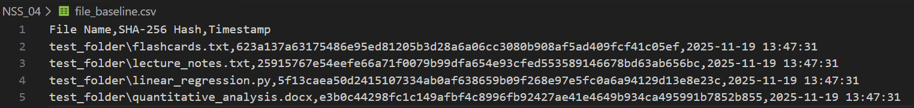
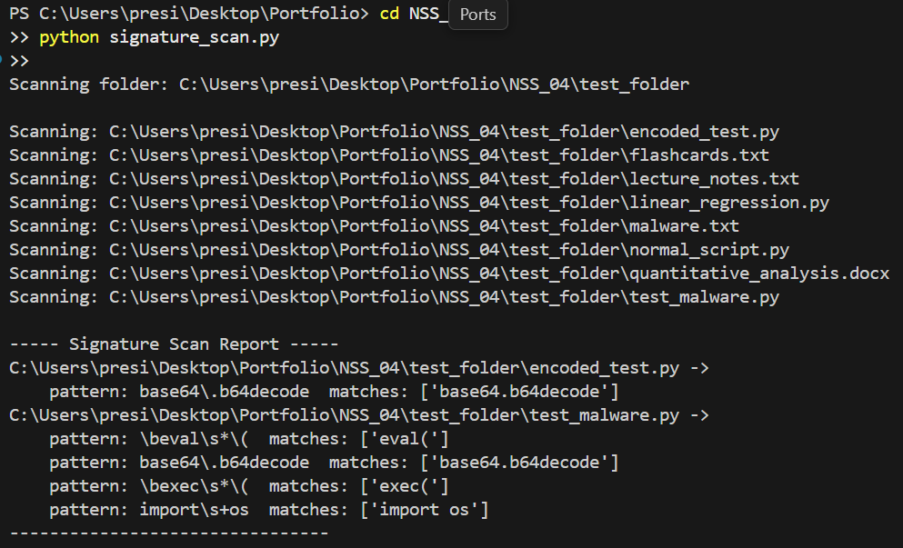

# 🛡️ Malicious Software Analysis

This Python-based toolkit simulates and detects malicious software behaviours using file integrity checks, network activity monitoring, static code signature scanning, and worm propagation modelling.  
The `test_folder` directory includes normal files (e.g. `lecture_notes.txt`, `linear_regression.py`) alongside intentionally malicious scripts (e.g. `test_malware.py`, `encoded_test.py`) used to demonstrate each module.

---

## 🧰 Technologies Used

- **Python ** – primary development language
- **hashlib & pathlib** – SHA-256 hashing and filesystem traversal  
- **csv & time** – structured CSV export and timestamp logging  
- **random & datetime** – simulated network events with time tracking  
- **re (Regular Expressions)** – pattern matching for static code analysis  

---

## ⭐ Main Features

### 🔐 File Integrity Checker — `file_integrity_checker.py`

Generates SHA-256 hashes for all files in `test_folder` and saves them to `file_baseline.csv`, creating a baseline for detecting unauthorised file changes.

### 🌐 Network Traffic Monitor — `network_monitor.py`

Simulates outbound requests from hosts and flags any that exceed the defined `ANOMALY_THRESHOLD`. Alerts are recorded in `network_alerts.csv` to demonstrate anomaly detection.

### 🧬 Static Signature Scanner — `signature_scan.py`

Scans files for suspicious patterns such as `eval()`, `exec()`, `socket.connect`, and `base64.b64decode`, reporting any files that contain potential malicious signatures.

### 🪱 Worm Propagation Simulator — `worm_simulation.py`

Models a self-replicating worm spreading across hosts, showing how infection counts grow each round to illustrate rapid malware propagation.

---

## ⚡ How to Run

### 1️⃣ Generate File Baseline
```bash
python file_integrity_checker.py
```
Creates file_baseline.csv with SHA-256 hashes and timestamps.



### 2️⃣ Monitor Network Traffic
```bash
python network_monitor.py
```
Simulates connections and logs anomalies to network_alerts.csv.


### 3️⃣ Scan for Malicious Signatures
```bash
python signature_scan.py
```
Outputs any files in test_folder containing defined suspicious patterns.



### 4️⃣ Simulate Worm Infection
```bash
python worm_simulation.py
```
Displays infection counts per step to illustrate worm spread dynamics.


### 5️⃣ Detects Changes
```bash
python detect_changes.py
```
Makes a report with any new file changes


## 🧪 Lab Report

### File Integrity Checker (`file_integrity_checker.py`)
Acts as a host-based antivirus system by generating a baseline of cryptographic hashes (SHA-256) for each file in a target folder. Upon running it, the script traverses the directory (using pathlib); therefore, it reads each file in binary mode and computes its SHA-256 digest. Subsequently, all results are saved to file_baseline.csv with columns for file path, hash, and timestamp. Hence, executing the checker on test_folder produced entries like:

* test_folder/lecture_notes.txt — 25915767e54... (SHA-256) — 2025-11-19 13:47:31  
* test_folder/linear_regression.py — 5f13caea50d2... — 2025-11-19 13:47:31  

These unique fingerprints guarantee that even a single-byte change in a file will yield a completely different hash. Based on integrity-checking theory, this method proves more reliable than just simple file size or timestamp checks. Therefore, by storing the baseline, our system can later detect unauthorised modifications relying on the comparison of new hashes against this “clean” state.

**Insights and Trade-offs:**  
The covered checksum approach is used for detecting tampering; however, it still has limitations. Let's say legitimate updates (e.g. software patches or content changes) result in alteration of hashes, requiring regular baseline updates or a change management process. On a larger scale, hashing every file can be time-consuming on directories containing a significant dataset. Following this implementation, reading files in 4KB blocks mitigates memory load. Some of the potential improvements could include parallel hashing or selective scanning for high-risk files to further optimise performance.

---

### Detecting Suspicious File Changes (`detect_changes.py`)
With the goal of strengthening the earlier build integrity baseline, the Detect Changes script (detect_changes.py) operates by comparing the current file hashes against the saved baseline to flag any differences. Based on them, it reads the baseline CSV into a dictionary (mapping file paths to their original hashes); furthermore, it then re-computes hashes for all existing files currently in the examined folder. By comparing these, our code identifies:

* Modified files: Same filename present but with a different hash  
* Deleted files: Files missing from the folder but present in the baseline  
* Created files: Newly added files not listed in the baseline  

For example, if test_folder/lecture_notes.txt is simply edited or a malicious script is added, running `detect_changes("test_folder")` will print a report like:

```
----- File Change Report -----
Modified: ['test_folder/lecture_notes.txt']
Deleted: None
Created: ['test_folder/new_script.py']
--------------------------------
```

**Insights and Trade-offs:**  
The implementation of the change-detection method further complements basic antivirus scanning by catching any alteration, even if the captured change is unknown malware. Nevertheless, it can be thwarted by rootkits that simply hide or intercept file reads at the kernel level, making any malicious modifications invisible to our script. One improvement could be as simple as normalising paths (e.g., using pathlib.Path.resolve()) followed by an automatic update to the baseline after a verified software update. Also, the current script reports all new and changed files without distinction; future optimised versions could integrate logging or automated rollback for critical files, transforming passive detection into active response.

---

### Network Traffic Monitor (`network_monitor.py`)
It was developed to give real-time anomaly-based detection on network traffic. The initiation step simulates outbound connection attempts from 50 hosts over a series of time steps. As time progresses, each host generates a random number of connections, starting with a “normal” amount up to 10, with a 10% chance of a random burst (5–10 extra attempts) to simulate occasional spikes. The script uses an ANOMALY_THRESHOLD (set to 15) causing any host exceeding the threshold count to trigger an alert. Furthermore, when an anomaly is detected, the event gets captured to network_alerts.csv and prints a timestamped message.

---

### Static Signature Scanner (`signature_scan.py`)
It Emulates the workflow of antivirus scanning. Starting with searches across each file in our presented folder to detect known suspicious code patterns (signatures) via regular expressions. Some of the defined patterns could include calls or keywords commonly found in malware (e.g., eval(, base64.b64decode, socket.connect, exec(, import os). As it reads each file’s text content, the scanner logs any matches. As examined in our scanning test_folder flagged:

* encoded_test.py -> Matches: ['base64\\.b64decode']  
* test_malware.py -> Matches: ['eval\\(', 'exec\\(']  

Implying that encoded_test.py contains a base64 decode routine (often used for obfuscation), while test_malware.py makes use of dynamic execution. As observed in the earlier report, all flagged scans were reported:

```
----- Signature Scan Report -----
test_folder/encoded_test.py -> Matches: ['base64\\.b64decode']
test_folder/test_malware.py -> Matches: ['eval\\(', 'exec\\(']
--------------------------------
```

**Insights and Trade-offs:**  
Obfuscated or polymorphic malware can evade the observed pattern checks. In the process of earlier development, there were some encountered issues: binary or very large files could not be read as text. Hence, as a precaution to handle this, the scanner uses `errors="ignore"` in read_text(), therefore causing the skipping of unreadable bytes. With that addition, it prevented crashes; however, a trade-off was that some content could be silently skipped. Most notably, a potential improvement could be to restrict scanning to text-based scripts only for the time being until more robust parsing has been achieved. Another significant consideration is the consistently present false positives: for instance, non-harmful code might use exec() innocuously.

---

### Worm Propagation Simulator (`worm_simulation.py`)
It models how a self-replicating worm spreads through a network. It represents the network as a list of hosts (initially all clean except host 0, which is “patient zero”). As time progresses with each simulation step, every infected host makes a fixed number of random infection attempts (attempts_per_host), with infection_chance representing the probability of infection. Corresponding to each step, our script keeps track of the cumulative number of infected hosts (e.g., “Step 5: 57/200 hosts infected”).

Running the simulation (with defaults: 200 hosts, 5 attempts each, 0.4 infection chance), as we can observe in the log, typically an exponential growth curve is achieved. For instance:

* Step 1: 3/200 infected  
* Step 5: 43/200 infected  
* Step 10: 156/200 infected  
* (By Step 15, most hosts are infected)

The parameter’s inputs play a crucial role in the rate of infection; hence, doubling attempts_per_host to 10 significantly accelerates spread (reaching near saturation in fewer steps), demonstrating the impact of scanning aggressiveness.

**Insights and Trade-offs:**  
In real networks, crucial factors like topology, firewall rules, and varying host vulnerabilities each have their impact, potentially causing an alteration in the curve. Ways to improve the accuracy include modelling subnets (favouring local propagation, which often speeds spread) or adding a “cure” probability to simulate patching.