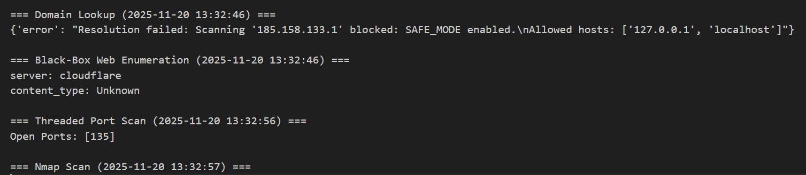

# 🔍 Penetration Testing Toolkit

A Python-based application designed to perform reconnaissance and scanning for penetration testing.  
The toolkit demonstrates how domain lookup, passive web enumeration, multi-threaded port scanning, and Nmap-based service enumeration can be combined to simulate early-stage penetration tests in a safe and controlled environment.

---

## 🧰 Technologies Used

- **Python 3** – Core development language throughout the project  
- **requests** – Sends HTTP requests for passive reconnaissance  
- **socket** – Implements TCP port scanning  
- **concurrent.futures** – Enables multi-threaded port scanning  
- **python-nmap** – Integrates Nmap functionality for service enumeration  
- **os / pathlib** – Supports structured file handling and reporting  

---

## ⭐ Main Features

- Performs **domain lookup** and resolves IP addresses  
- Conducts **passive web enumeration** to collect HTTP headers  
- Executes **threaded TCP port scans** for faster discovery  
- Integrates **Nmap service detection** for detailed port and service info  
- Writes **timestamped structured reports** suitable for review  
- Implements **SAFE_MODE** to prevent unauthorized scanning of external hosts  
- Supports **configurable target domains and ports** for flexible testing  
- Modular design allows easy extension for additional reconnaissance or scanning features  

## ⚡ How to Run Locally


### 1️⃣ **Install required packages**  
```bash
pip install -r requirements.txt
```


### 2️⃣ **Run the main application**  
```bash
python main.py
```

### 3️⃣ **View the output**  
Results are written to `report.txt` and include:  
- Domain IP resolution and metadata  
- Passive web header enumeration  
- Open ports detected by threaded scanner  
- Service and version information from Nmap



---

## 🧩 System Architecture


## 🧪 Lab Report

## Implementation — Modules & Examples from the Codebase

### Core Utilities

**`core.utils.safe_socket()`** creates a socket with a timeout and is used with a `with` statement:

```python
def safe_socket(timeout=1.0):  [1]
    sock = socket.socket(socket.AF_INET, socket.SOCK_STREAM)
    sock.settimeout(timeout)
    return sock
```

**`core.utils.timestamp()`** centralises timestamps for all reports. [2]

**Why this matters:** centralised utilities reduce potential duplication (single timeout config) hence resulting in consistent behaviour across scanning of modules.

---

### Safety / Validation

**`core.validators.validate_host()`** enforces `SAFE_MODE`:

```python
from config.settings import SAFE_MODE, ALLOWED_HOSTS  [3]

def validate_host(host):
    if not SAFE_MODE:
        return True

    if host in ALLOWED_HOSTS:
        return True

    raise PermissionError(
        f"Scanning '{host}' blocked: SAFE_MODE enabled.\n"
        f"Allowed hosts: {ALLOWED_HOSTS}"
    )
```

**Practical effect:** any attempt to scan a disallowed IP raises `PermissionError`. Observed in the `report.txt`: [3]

```
=== Domain Lookup (2025-11-20 13:32:46) ===
{'error': "Resolution failed: Scanning '185.158.133.1' blocked: SAFE_MODE enabled.\nAllowed hosts: ['127.0.0.1', 'localhost']"} [3]
```

**Why this matters:** legal/ethical safety is a core requirement for network tooling; `SAFE_MODE` solidifies our application by preventing accidental scanning of external infrastructure during development.

---

### Passive Web Enumeration

**`reconnaissance.passive_recon.fetch_headers()`** calls `requests.head()`:

```python
res = requests.head(url, timeout=3, headers={"User-Agent": USER_AGENT}) [4]
return {
    "server": res.headers.get("Server", "Hidden/Unknown"),
    "content_type": res.headers.get("Content-Type", "Unknown"),
}
```

**Notes:** using `HEAD` is lightweight; the User-Agent is configurable via `config.settings.USER_AGENT` [4].  The recorded example shows Cloudflare as the server:

```
=== Black-Box Web Enumeration (2025-11-20 13:32:46) ===
server: cloudflare
content_type: Unknown
```

---

### Domain Lookup

**`reconnaissance.domain_lookup.lookup_domain()`** resolves domain → IP and enriches with geo/org metadata (via an external IP API), while respecting `validate_host()` so `SAFE_MODE` can block external IPs.

**Why this matters:** enrichment further improves our work on triage targets, hence our code defers to `SAFE_MODE` before making network-enriching requests.

---

### Threaded Port Scanner

**`scanning.threaded_port_scanner.threaded_scan()`** uses a `ThreadPoolExecutor` to parallelise TCP connect checks via `scanning.basic_port_scanner.scan_port()` [5]:

```python
def threaded_scan(host, ports, workers=20):
    validate_host(host)
    results = []

    def task(port):
        return port if scan_port(host, port) else None

    with ThreadPoolExecutor(max_workers=workers) as exe: [5]
        for r in exe.map(task, ports):
            if r:
                results.append(r)

    return sorted(results)
```

**Design points & example:**

* `scan_port()` uses `safe_socket()` and `sock.connect_ex((host, port))` returning `True` for open ports.
* The main run scans `127.0.0.1` ports 1-200 and the report shows an example result: `Open Ports: [135]`.
* `test_threaded.py` offers a quick local check [5]:

```python
from scanning.threaded_port_scanner import threaded_scan
print(threaded_scan('127.0.0.1', range(1,100)))
```

**Why this matters:** concurrency reduces wall-clock scanning time for many ports; mapping with a thread pool enables us to keep simplicity while maintaining robustness.

---

### Nmap Integration

**`scanning.nmap_interface.nmap_service_scan()`** wraps python-nmap:

```python
scanner = nmap.PortScanner() [6]
scanner.scan(host, port_range, arguments="-sV") [6][7]
...
for h in scanner.all_hosts():
    for proto in scanner[h].all_protocols():
        for port, data in scanner[h][proto].items():
            findings.append(
                f"{h}:{port} {data['state']} → {data.get('name','?')} {data.get('version','')}"
            )
```

**Why this matters:** Nmap further elevates the robust service/version detection (`-sV`) and complements raw TCP connect results with service names and version strings for richer reporting.

---

### Reporting

**`core.report_writer.write_report()`** appends timestamped sections to `report.txt` [8]:

```python
with open(path, "a") as f: 
    f.write(f"\n=== {title} ({timestamp()}) ===\n")
    for line in data:
        f.write(f"{line}\n")
```

**Why this matters:** human-readable, timestamped logs are ideal for evidence in assignments and professional reports. The file shows combined domain lookup, passive headers, threaded scan and nmap outputs.

---

### Results (Observed During Runs)

```
=== Domain Lookup (2025-11-20 13:32:46) ===
{'error': "Resolution failed: Scanning '185.158.133.1' blocked: SAFE_MODE enabled.\nAllowed hosts: ['127.0.0.1', 'localhost']"}

=== Black-Box Web Enumeration (2025-11-20 13:32:46) ===
server: cloudflare
content_type: Unknown

=== Threaded Port Scan (2025-11-20 13:32:56) ===
Open Ports: [135]
```

**`test_threaded.py`** is a minimal functional test:

```python
from scanning.threaded_port_scanner import threaded_scan
print(threaded_scan('127.0.0.1', range(1,100)))
```

---

### Analysis — Correctness, Trade-offs, and Limitations

**Concurrency & Performance:**

* Threaded scanning (20 workers) is an effective, low-complexity approach for I/O-bound TCP connect checks.
* **Trade-offs:** too few workers → slow scans; too many → thread scheduling overhead, connection storms, or local resource exhaustion.
* The ideal worker count depends on the host OS, network stack, and target latency.

**Accuracy of Service Detection:**

* Raw `connect_ex()` tells you port state (open/closed), but not service details. Nmap fills that gap via `-sV`.
* **Limitation:** python-nmap depends on the locally installed nmap binary and proper permissions. If nmap is missing or runs with restricted privileges, `nmap_service_scan()` returns an error object.

**Robustness and Error Handling:**

* Network code correctly uses timeouts and exception blocks in `passive_recon.fetch_headers()` and `domain_lookup()`.
* **Opportunity:** unify timeout values — `config.settings.DEFAULT_TIMEOUT` exists but `safe_socket()` uses a hard-coded 1.0 default. Centralising the timeout would reduce divergence.

## References

[1] Python Software Foundation (no date) *socket — Low-level networking interface*. Available at: https://docs.python.org/3/library/socket.html

[2] Python Software Foundation (no date) *datetime — Basic date and time types*. Available at: https://docs.python.org/3/library/datetime.html

[3] OWASP Foundation (no date) *OWASP Testing Guide / Legal and Ethical Testing Considerations*. Available at: https://owasp.org/www-project-web-security-testing-guide/

[4] Python-Requests Community (no date) *Requests: HTTP for Humans — Quickstart / API*. Available at: https://docs.python-requests.org/en/latest/

[5] Python Software Foundation (no date) *concurrent.futures — Launching parallel tasks*. Available at: https://docs.python.org/3/library/concurrent.futures.html

[6] python-nmap project (no date) *python-nmap — PortScanner for Nmap*. Available at: https://pypi.org/project/python-nmap/

[7] Fyodor (no date) *Nmap Reference — Version Detection (-sV)*. Available at: https://nmap.org/book/man-version-detection.html

[8] Python Software Foundation (no date) *open() — Built-in function for file I/O*. Available at: https://docs.python.org/3/library/functions.html#open
